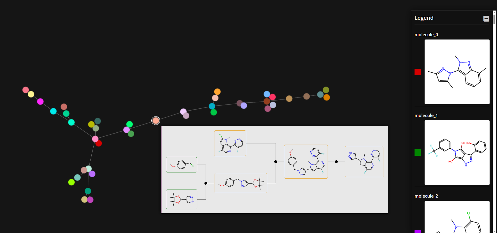

# RetroGraph: AiZynthFinder Tree Visualization with TMAP

Visualize AiZynthFinder synthesis route trees using a layout generated by Tree Edit Distance (TED) TMAP.

This tool loads synthesis trees from AiZynthFinder output, computes a TMAP layout based on TED similarity between the trees, and generates an interactive HTML visualization using Faerun.

## Features

*   Loads AiZynthFinder reaction trees from `.json.gz` files.
*   Converts AiZynthFinder trees to an internal `SynthesisTree` representation.
*   Calculates Tree Edit Distance (TED) between trees using the `apted` library.
    *   Note: TED costs (delete, insert, rename) are currently defined as constants within `src/retrograph/config/ted_config.py`. The node rename cost considers reaction similarity based on `namerxn` reaction classes.
*   Generates a 2D layout using TMAP, connecting similar trees based on a TED threshold.
*   Creates interactive HTML visualizations with Faerun, showing the TMAP layout, tree structures on hover, and grouping by target molecule.
    *   The legend in the HTML output allows toggling the visibility of specific target molecules and can be minimized when not needed.

## Installation

1.  **Clone the repository:**
    ```bash
    git clone <your-repository-url>
    cd retrograph
    ```

2.  **Create and activate Conda environment:**
    Make sure you have Anaconda or Miniconda installed. Then create the environment using the appropriate file for your operating system:

    *   **Windows:**
        ```bash
        conda env create -f env_win.yml
        conda activate retrograph
        ```
    *   **Linux:**
        ```bash
        conda env create -f env_linux.yml
        conda activate retrograph
        ```

    **Note:** This tool has been tested on Windows 11 and Red Hat Linux.

## Usage

Run the main script, providing the path to your AiZynthFinder output file:

```bash
python retrograph.py <path/to/aizynthfinder_output.json.gz> [OPTIONS]
```

**Example:**

```bash
python retrograph.py output.json.gz --ted-threshold 3.0 --output my_visualization
```

**Options:**

*   `--ted-threshold`: Maximum TED for connecting trees (default: 3.0).
*   `--force-connect`: Force connection between clusters, even if TED > threshold.
*   `--output`: Output file name prefix (without .html extension). Can include relative/absolute path.

*   `--bg-color`: Background color for the Faerun plot (hex code).

## Example Output

Here's an example of the interactive visualization generated by RetroGraph:



You can also explore a pre-generated example visualization by opening the `example\retrograph.html` file in your web browser.

## License

This project is licensed under the MIT License. See the [LICENSE.md](LICENSE.md) file for details. It incorporates code derived from the original `tmap` library, available at [https://github.com/reymond-group/tmap](https://github.com/reymond-group/tmap).
